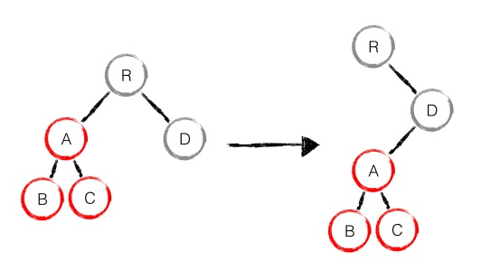

## HTML

### 简述 `<!DOCTYPE>` 标签的作用

#### 概念

DOCTYPE 标签是一种标准通用标记语言的文档类型声明，它的目的是要告诉标准通用标记语言解析器，它应该使用什么样的文档类型定义（DTD）来解析文档。

`<!DOCTYPE>` 声明必须是 HTML 文档的第一行，位于标签之前。

#### 种类

##### HTML 5

使用方式 `<!DOCTYPE html>`

##### HTML 4.01 Strict

使用方式

```html
<!DOCTYPE html PUBLIC "-//W3C//DTD HTML 4.01//EN" "http://www.w3.org/TR/html4/strict.dtd">
```

该 DTD 包含所有 HTML 元素和属性，但不包括展示性的和弃用的元素（比如 font）。不允许框架集（Framesets）。

##### HTML 4.01 Transitional

使用方式

```html
<!DOCTYPE html PUBLIC "-//W3C//DTD HTML 4.01 Transitional//EN" "http://www.w3.org/TR/html4/loose.dtd">
```

该 DTD 包含所有 HTML 元素和属性，包括展示性的和弃用的元素（比如 font）。不允许框架集（Framesets）。

- HTML 4.01 Frameset

使用方式

```html
<!DOCTYPE html PUBLIC "-//W3C//DTD HTML 4.01 Frameset//EN" "http://www.w3.org/TR/html4/frameset.dtd">
```

该 DTD 等同于 HTML 4.01 Transitional，但允许框架集内容。

其他的还有 XHTML 1.0 Strict ， XHTML 1.0 Transitional， XHTML 1.0 Frameset ，XHTML 1.1 等等

## CSS

### 重绘和回流

> 引自 [浏览器的回流与重绘 (Reflow & Repaint)](https://juejin.im/post/5a9923e9518825558251c96a)

在讨论回流与重绘之前，我们要知道：

- 浏览器使用流式布局模型 (Flow Based Layout)。

- 浏览器会把 HTML 解析成 DOM，把 CSS 解析成 CSSOM，DOM 和 CSSOM 合并就产生了 Render Tree。
  有了 RenderTree，我们就知道了所有节点的样式，然后计算他们在页面上的大小和位置，最后把节点绘制到页面上。

- 由于浏览器使用流式布局，对 Render Tree 的计算通常只需要遍历一次就可以完成，但 table 及其内部元素除外，他们可能需要多次计算，通常要花 3 倍于同等元素的时间，这也是为什么要避免使用 table 布局的原因之一。

**一句话：回流必将引起重绘，重绘不一定会引起回流**

### 回流 (Reflow)

当 Render Tree 中部分或全部元素的尺寸、结构、或某些属性发生改变时，浏览器重新渲染部分或全部文档的过程称为回流。

会导致回流的操作：

- 页面首次渲染

- 浏览器窗口大小发生改变

- 元素尺寸或位置发生改变

- 元素内容变化（文字数量或图片大小等等）

- 元素字体大小变化

- 添加或者删除可见的 DOM 元素

- 激活 CSS 伪类（例如：`:hover`）

- 查询某些属性或调用某些方法

一些常用且会导致回流的属性和方法：

- `clientWidth`、`clientHeight`、`clientTop`、`clientLeft`

- `offsetWidth`、`offsetHeight`、`offsetTop`、`offsetLeft`
- `scrollWidth`、`scrollHeight`、`scrollTop`、`scrollLeft`
- `scrollIntoView()`、`scrollIntoViewIfNeeded()`
- `getComputedStyle()`
- `getBoundingClientRect()`
- `scrollTo()`

### 重绘 (Repaint)

当页面中元素样式的改变并不影响它在文档流中的位置时（例如：`color`、`background-color`、`visibility` 等），浏览器会将新样式赋予给元素并重新绘制它，这个过程称为重绘。

### 性能影响

**回流比重绘的代价要更高**

有时即使仅仅回流一个单一的元素，它的父元素以及任何跟随它的元素也会产生回流

现代浏览器会对频繁的回流或重绘操作进行优化：

浏览器会维护一个队列，把所有引起回流和重绘的操作放入队列中，如果队列中的任务数量或者时间间隔达到一个阈值的，浏览器就会将队列清空，进行一次批处理，这样可以把多次回流和重绘变成一次。
当你访问以下属性或方法时，浏览器会立刻清空队列：

- `clientWidth`、`clientHeight`、`clientTop`、`clientLeft`

- `offsetWidth`、`offsetHeight`、`offsetTop`、`offsetLeft`

- `scrollWidth`、`scrollHeight`、`scrollTop`、`scrollLeft`

- `width`、`height`

- `getComputedStyle()`

- `getBoundingClientRect()`

因为队列中可能会有影响到这些属性或方法返回值的操作，即使你希望获取的信息与队列中操作引发的改变无关，浏览器也会强行清空队列，确保你拿到的值是最精确的。

### 如何避免

#### CSS

- 避免使用 table 布局。

- 尽可能在 DOM 树的最末端改变 class。

- 避免设置多层内联样式。

- 将动画效果应用到 position 属性为 absolute 或 fixed 的元素上。

- 避免使用 CSS 表达式（例如：`calc()`）。

#### JavaScript

- 避免频繁操作样式，最好一次性重写 style 属性，或者将样式列表定义为 class 并一次性更改 class 属性。

- 避免频繁操作 DOM，创建一个 documentFragment，在它上面应用所有 DOM 操作，最后再把它添加到文档中。

- 也可以先为元素设置 `display: none`，操作结束后再把它显示出来。因为在 display 属性为 none 的元素上进行的 DOM 操作不会引发回流和重绘。

- 避免频繁读取会引发回流/重绘的属性，如果确实需要多次使用，就用一个变量缓存起来。

- 对具有复杂动画的元素使用绝对定位，使它脱离文档流，否则会引起父元素及后续元素频繁回流。

## JS

### 实现 `bind` 函数

```js
Function.prototype.myBind = function(obj) {
  if (typeof this !== 'function') {
    throw new Error('no function')
  }
  var args = Array.prototype.slice.call(arguments, 1),
    fToBind = this,
    // 为了保持原型链构造的空函数
    fNOP = function() {},
    fBound = function() {
      return fToBind.apply(
        // 判断是否是 new 操作符创建的对象
        this instanceof fNOP ? this : obj,
        args.concat(Array.prototype.slice.call(arguments))
      )
    }

  if (this.prototype) {
    fNOP.prototype = this.prototype
  }
  fBound.prototype = new fNOP()
  return fBound
}
```

### 柯里化 add 函数

## 网络

## React

### 受控组件和非受控组件

#### 区别

受控组件即表单的值和 `this.state` 同步, 通过 `<input>` 标签的 `onChange` 来 `setState` 更新组件的状态, 这意味着数据和 UI 是 同步的

非受控组件即利用 `ref` 来创建一个对标签的引用, 从而让 DOM 自己控制 `<input>` 标签的值, 在 `onSubmit` 的时候获取各标签的值

#### 用法

当你需要

- 实时验证
- 通过 input 的值来控制按钮的状态等
- 强制规定某种输入格式, 比如信用卡号码

时, 受控组件是第一选择. 除此之外, 非受控组件容易集成 React 和非 React 的代码, 并且快速 + 易用, 是场景比较轻的时候的一种选择

_注意:_ `<input>` 标签的使用应该始终是非受控的, 因为它的值只能由用户控制

参考:

- [uncontrolled-components](https://reactjs.org/docs/uncontrolled-components.html)

- [Controlled and uncontrolled form inputs in React don't have to be complicated](https://goshakkk.name/controlled-vs-uncontrolled-inputs-react/)

### diff 算法

> 引自知乎专栏 [pure render](https://zhuanlan.zhihu.com/p/20346379)

React 通过制定大胆的策略，将 `O(n^3)` 复杂度的问题转换成 `O(n)` 复杂度的问题

#### diff 策略

Web UI 中 DOM 节点跨层级的移动操作特别少，可以忽略不计

拥有相同类的两个组件将会生成相似的树形结构，拥有不同类的两个组件将会生成不同的树形结构

对于同一层级的一组子节点，它们可以通过唯一 id 进行区分

基于以上三个前提策略，React 分别对 tree diff、component diff 以及 element diff 进行算法优化，事实也证明这三个前提策略是合理且准确的，它保证了整体界面构建的性能

#### tree diff

基于策略一，React 对树的算法进行了简洁明了的优化，即对树进行分层比较，两棵树只会对同一层次的节点进行比较

既然 DOM 节点跨层级的移动操作少到可以忽略不计，针对这一现象，React 通过 updateDepth 对 Virtual DOM 树进行层级控制，只会对相同颜色方框内的 DOM 节点进行比较，即同一个父节点下的所有子节点。当发现节点已经不存在，则该节点及其子节点会被完全删除掉，不会用于进一步的比较。这样只需要对树进行一次遍历，便能完成整个 DOM 树的比较


```js
function updateChildren(nextNestedChildrenElements, transaction, context) {
  updateDepth++
  var errorThrown = true
  try {
    this._updateChildren(nextNestedChildrenElements, transaction, context)
    errorThrown = false
  } finally {
    updateDepth--
    if (!updateDepth) {
      if (errorThrown) {
        clearQueue()
      } else {
        processQueue()
      }
    }
  }
}
```

分析至此，大部分人可能都存在这样的疑问：如果出现了 DOM 节点跨层级的移动操作，React diff 会有怎样的表现呢？是的，对此我也好奇不已，不如试验一番。

如下图，A 节点（包括其子节点）整个被移动到 D 节点下，由于 React 只会简单的考虑同层级节点的位置变换，而对于不同层级的节点，只有创建和删除操作。当根节点发现子节点中 A 消失了，就会直接销毁 A；当 D 发现多了一个子节点 A，则会创建新的 A（包括子节点）作为其子节点。此时，React diff 的执行情况：create A -> create B -> create C -> delete A。



由此可发现，当出现节点跨层级移动时，并不会出现想象中的移动操作，而是以 A 为根节点的树被整个重新创建，这是一种影响 React 性能的操作，因此 React 官方建议不要进行 DOM 节点跨层级的操作。

> 注意：在开发组件时，保持稳定的 DOM 结构会有助于性能的提升。例如，可以通过 CSS 隐藏或显示节点，而不是真的移除或添加 DOM 节点。

#### component diff

React 是基于组件构建应用的，对于组件间的比较所采取的策略也是简洁高效。

- 如果是同一类型的组件，按照原策略继续比较 virtual DOM tree。

- 如果不是，则将该组件判断为 dirty component，从而替换整个组件下的所有子节点。

- 对于同一类型的组件，有可能其 Virtual DOM 没有任何变化，如果能够确切的知道这点那可以节省大量的 diff 运算时间，因此 React 允许用户通过 `shouldComponentUpdate()` 来判断该组件是否需要进行 diff。

如下图，当 component D 改变为 component G 时，即使这两个 component 结构相似，一旦 React 判断 D 和 G 是不同类型的组件，就不会比较二者的结构，而是直接删除 component D，重新创建 component G 以及其子节点。虽然当两个 component 是不同类型但结构相似时，React diff 会影响性能，但正如 React 官方博客所言：不同类型的 component 是很少存在相似 DOM tree 的机会，因此这种极端因素很难在实现开发过程中造成重大影响的。


#### element diff

当节点处于同一层级时，React diff 提供了三种节点操作，分别为：INSERT_MARKUP（插入）、MOVE_EXISTING（移动）和 REMOVE_NODE（删除）。

- INSERT_MARKUP，新的 component 类型不在老集合里， 即是全新的节点，需要对新节点执行插入操作。

- MOVE_EXISTING，在老集合有新 component 类型，且 element 是可更新的类型，generateComponentChildren 已调用 receiveComponent，这种情况下 prevChild=nextChild，就需要做移动操作，可以复用以前的 DOM 节点。

- REMOVE_NODE，老 component 类型，在新集合里也有，但对应的 element 不同则不能直接复用和更新，需要执行删除操作，或者老 component 不在新集合里的，也需要执行删除操作。

```js
function enqueueInsertMarkup(parentInst, markup, toIndex) {
  updateQueue.push({
    parentInst: parentInst,
    parentNode: null,
    type: ReactMultiChildUpdateTypes.INSERT_MARKUP,
    markupIndex: markupQueue.push(markup) - 1,
    content: null,
    fromIndex: null,
    toIndex: toIndex,
  })
}

function enqueueMove(parentInst, fromIndex, toIndex) {
  updateQueue.push({
    parentInst: parentInst,
    parentNode: null,
    type: ReactMultiChildUpdateTypes.MOVE_EXISTING,
    markupIndex: null,
    content: null,
    fromIndex: fromIndex,
    toIndex: toIndex,
  })
}

function enqueueRemove(parentInst, fromIndex) {
  updateQueue.push({
    parentInst: parentInst,
    parentNode: null,
    type: ReactMultiChildUpdateTypes.REMOVE_NODE,
    markupIndex: null,
    content: null,
    fromIndex: fromIndex,
    toIndex: null,
  })
}
```

如下图，老集合中包含节点：A、B、C、D，更新后的新集合中包含节点：B、A、D、C，此时新老集合进行 diff 差异化对比，发现 B != A，则创建并插入 B 至新集合，删除老集合 A；以此类推，创建并插入 A、D 和 C，删除 B、C 和 D。


React 发现这类操作繁琐冗余，因为这些都是相同的节点，但由于位置发生变化，导致需要进行繁杂低效的删除、创建操作，其实只要对这些节点进行位置移动即可。

针对这一现象，React 提出优化策略：允许开发者对同一层级的同组子节点，添加唯一 key 进行区分，虽然只是小小的改动，性能上却发生了翻天覆地的变化！

新老集合所包含的节点，如下图所示，新老集合进行 diff 差异化对比，通过 key 发现新老集合中的节点都是相同的节点，因此无需进行节点删除和创建，只需要将老集合中节点的位置进行移动，更新为新集合中节点的位置，此时 React 给出的 diff 结果为：B、D 不做任何操作，A、C 进行移动操作，即可。


那么，如此高效的 diff 到底是如何运作的呢？让我们通过源码进行详细分析。

首先对新集合的节点进行循环遍历，for (name in nextChildren)，通过唯一 key 可以判断新老集合中是否存在相同的节点，if (prevChild === nextChild)，如果存在相同节点，则进行移动操作，但在移动前需要将当前节点在老集合中的位置与 lastIndex 进行比较，if (child.\_mountIndex < lastIndex)，则进行节点移动操作，否则不执行该操作。这是一种顺序优化手段，lastIndex 一直在更新，表示访问过的节点在老集合中最右的位置（即最大的位置），如果新集合中当前访问的节点比 lastIndex 大，说明当前访问节点在老集合中就比上一个节点位置靠后，则该节点不会影响其他节点的位置，因此不用添加到差异队列中，即不执行移动操作，只有当访问的节点比 lastIndex 小时，才需要进行移动操作。

以上图为例，可以更为清晰直观的描述 diff 的差异对比过程：

- 从新集合中取得 B，判断老集合中存在相同节点 B，通过对比节点位置判断是否进行移动操作，B 在老集合中的位置 B.\_mountIndex = 1，此时 lastIndex = 0，不满足 child.\_mountIndex < lastIndex 的条件，因此不对 B 进行移动操作；更新 lastIndex = Math.max(prevChild.\_mountIndex, lastIndex)，其中 prevChild.\_mountIndex 表示 B 在老集合中的位置，则 lastIndex ＝ 1，并将 B 的位置更新为新集合中的位置 prevChild.\_mountIndex = nextIndex，此时新集合中 B.\_mountIndex = 0，nextIndex++ 进入下一个节点的判断。

- 从新集合中取得 A，判断老集合中存在相同节点 A，通过对比节点位置判断是否进行移动操作，A 在老集合中的位置 A.\_mountIndex = 0，此时 lastIndex = 1，满足 child.\_mountIndex < lastIndex 的条件，因此对 A 进行移动操作 enqueueMove(this, child.\_mountIndex, toIndex)，其中 toIndex 其实就是 nextIndex，表示 A 需要移动到的位置；更新 lastIndex = Math.max(prevChild.\_mountIndex, lastIndex)，则 lastIndex ＝ 1，并将 A 的位置更新为新集合中的位置 prevChild.\_mountIndex = nextIndex，此时新集合中 A.\_mountIndex = 1，nextIndex++ 进入下一个节点的判断。

- 从新集合中取得 D，判断老集合中存在相同节点 D，通过对比节点位置判断是否进行移动操作，D 在老集合中的位置 D.\_mountIndex = 3，此时 lastIndex = 1，不满足 child.\_mountIndex < lastIndex 的条件，因此不对 D 进行移动操作；更新 lastIndex = Math.max(prevChild.\_mountIndex, lastIndex)，则 lastIndex ＝ 3，并将 D 的位置更新为新集合中的位置 prevChild.\_mountIndex = nextIndex，此时新集合中 D.\_mountIndex = 2，nextIndex++ 进入下一个节点的判断。

- 从新集合中取得 C，判断老集合中存在相同节点 C，通过对比节点位置判断是否进行移动操作，C 在老集合中的位置 C.\_mountIndex = 2，此时 lastIndex = 3，满足 child.\_mountIndex < lastIndex 的条件，因此对 C 进行移动操作 enqueueMove(this, child.\_mountIndex, toIndex)；更新 lastIndex = Math.max(prevChild.\_mountIndex, lastIndex)，则 lastIndex ＝ 3，并将 C 的位置更新为新集合中的位置 prevChild.\_mountIndex = nextIndex，此时新集合中 C.\_mountIndex = 3，nextIndex++ 进入下一个节点的判断，由于 C 已经是最后一个节点，因此 diff 到此完成。

以上主要分析新老集合中存在相同节点但位置不同时，对节点进行位置移动的情况，如果新集合中有新加入的节点且老集合存在需要删除的节点，那么 React diff 又是如何对比运作的呢？

以下图为例：


- 从新集合中取得 B，判断老集合中存在相同节点 B，由于 B 在老集合中的位置 B.\_mountIndex = 1，此时 lastIndex = 0，因此不对 B 进行移动操作；更新 lastIndex ＝ 1，并将 B 的位置更新为新集合中的位置 B.\_mountIndex = 0，nextIndex++进入下一个节点的判断。

- 从新集合中取得 E，判断老集合中不存在相同节点 E，则创建新节点 E；更新 lastIndex ＝ 1，并将 E 的位置更新为新集合中的位置，nextIndex++进入下一个节点的判断。

- 从新集合中取得 C，判断老集合中存在相同节点 C，由于 C 在老集合中的位置 C.\_mountIndex = 2，lastIndex = 1，此时 C.\_mountIndex > lastIndex，因此不对 C 进行移动操作；更新 lastIndex ＝ 2，并将 C 的位置更新为新集合中的位置，nextIndex++ 进入下一个节点的判断。

- 从新集合中取得 A，判断老集合中存在相同节点 A，由于 A 在老集合中的位置 A.\_mountIndex = 0，lastIndex = 2，此时 A.\_mountIndex < lastIndex，因此对 A 进行移动操作；更新 lastIndex ＝ 2，并将 A 的位置更新为新集合中的位置，nextIndex++ 进入下一个节点的判断。

- 当完成新集合中所有节点 diff 时，最后还需要对老集合进行循环遍历，判断是否存在新集合中没有但老集合中仍存在的节点，发现存在这样的节点 D，因此删除节点 D，到此 diff 全部完成。

```js
_updateChildren: function(nextNestedChildrenElements, transaction, context) {
  var prevChildren = this._renderedChildren;
  var nextChildren = this._reconcilerUpdateChildren(
    prevChildren, nextNestedChildrenElements, transaction, context
  );
  if (!nextChildren && !prevChildren) {
    return;
  }
  var name;
  var lastIndex = 0;
  var nextIndex = 0;
  for (name in nextChildren) {
    if (!nextChildren.hasOwnProperty(name)) {
      continue;
    }
    var prevChild = prevChildren && prevChildren[name];
    var nextChild = nextChildren[name];
    if (prevChild === nextChild) {
      // 移动节点
      this.moveChild(prevChild, nextIndex, lastIndex);
      lastIndex = Math.max(prevChild._mountIndex, lastIndex);
      prevChild._mountIndex = nextIndex;
    } else {
      if (prevChild) {
        lastIndex = Math.max(prevChild._mountIndex, lastIndex);
        // 删除节点
        this._unmountChild(prevChild);
      }
      // 初始化并创建节点
      this._mountChildAtIndex(
        nextChild, nextIndex, transaction, context
      );
    }
    nextIndex++;
  }
  for (name in prevChildren) {
    if (prevChildren.hasOwnProperty(name) &&
        !(nextChildren && nextChildren.hasOwnProperty(name))) {
      this._unmountChild(prevChildren[name]);
    }
  }
  this._renderedChildren = nextChildren;
},
// 移动节点
moveChild: function(child, toIndex, lastIndex) {
  if (child._mountIndex < lastIndex) {
    this.prepareToManageChildren();
    enqueueMove(this, child._mountIndex, toIndex);
  }
},
// 创建节点
createChild: function(child, mountImage) {
  this.prepareToManageChildren();
  enqueueInsertMarkup(this, mountImage, child._mountIndex);
},
// 删除节点
removeChild: function(child) {
  this.prepareToManageChildren();
  enqueueRemove(this, child._mountIndex);
},

_unmountChild: function(child) {
  this.removeChild(child);
  child._mountIndex = null;
},

_mountChildAtIndex: function(
  child,
  index,
  transaction,
  context) {
  var mountImage = ReactReconciler.mountComponent(
    child,
    transaction,
    this,
    this._nativeContainerInfo,
    context
  );
  child._mountIndex = index;
  this.createChild(child, mountImage);
},
```

当然，React diff 还是存在些许不足与待优化的地方，如下图所示，若新集合的节点更新为：D、A、B、C，与老集合对比只有 D 节点移动，而 A、B、C 仍然保持原有的顺序，理论上 diff 应该只需对 D 执行移动操作，然而由于 D 在老集合的位置是最大的，导致其他节点的 \_mountIndex < lastIndex，造成 D 没有执行移动操作，而是 A、B、C 全部移动到 D 节点后面的现象。

在此，读者们可以讨论思考：如何优化上述问题？

> 建议：在开发过程中，尽量减少类似将最后一个节点移动到列表首部的操作，当节点数量过大或更新操作过于频繁时，在一定程度上会影响 React 的渲染性能。


#### 总结

- React 通过制定大胆的 diff 策略，将 O(n3) 复杂度的问题转换成 O(n) 复杂度的问题；

- React 通过分层求异的策略，对 tree diff 进行算法优化；

- React 通过相同类生成相似树形结构，不同类生成不同树形结构的策略，对 component diff 进行算法优化；

- React 通过设置唯一 key 的策略，对 element diff 进行算法优化；

- 建议，在开发组件时，保持稳定的 DOM 结构会有助于性能的提升；

- 建议，在开发过程中，尽量减少类似将最后一个节点移动到列表首部的操作，当节点数量过大或更新操作过于频繁时，在一定程度上会影响 React 的渲染性能。

## 其他

### requestAnimationFrame 相关

> `window.requestAnimationFrame()` 告诉浏览器——你希望执行一个动画，并且要求浏览器在下次重绘之前调用指定的回调函数更新动画。该方法需要传入一个回调函数作为参数，该回调函数会在浏览器下一次重绘(repaint)之前执行 (摘自 MDN)

用法为

```ts
requestAnimationFrame(callback: (timestamp: number) => void): number
```

`callback` 为更新动画的逻辑, 接收一个参数 `timestamp` 表示 `requestAnimationFrame` 执行 `callback` 的时刻, 返回一个 ID 可供 `window.cancelAnimationFrame` 取消该回调

#### `requestAnimationFrame` 和 `setInterval` 的区别

setTimeout 和 setInterval 的问题是，它们都不精确。它们的内在运行机制决定了时间间隔参数实际上只是指定了把动画代码添加到浏览器 UI 线程队列中以等待执行的时间。如果队列前面已经加入了其他任务，那动画代码就要等前面的任务完成后再执行

requestAnimationFrame 采用系统时间间隔，保持最佳绘制效率，不会因为间隔时间过短，造成过度绘制，增加开销；也不会因为间隔时间太长，使用动画卡顿不流畅，让各种网页动画效果能够有一个统一的刷新机制，从而节省系统资源，提高系统性能，改善视觉效果
