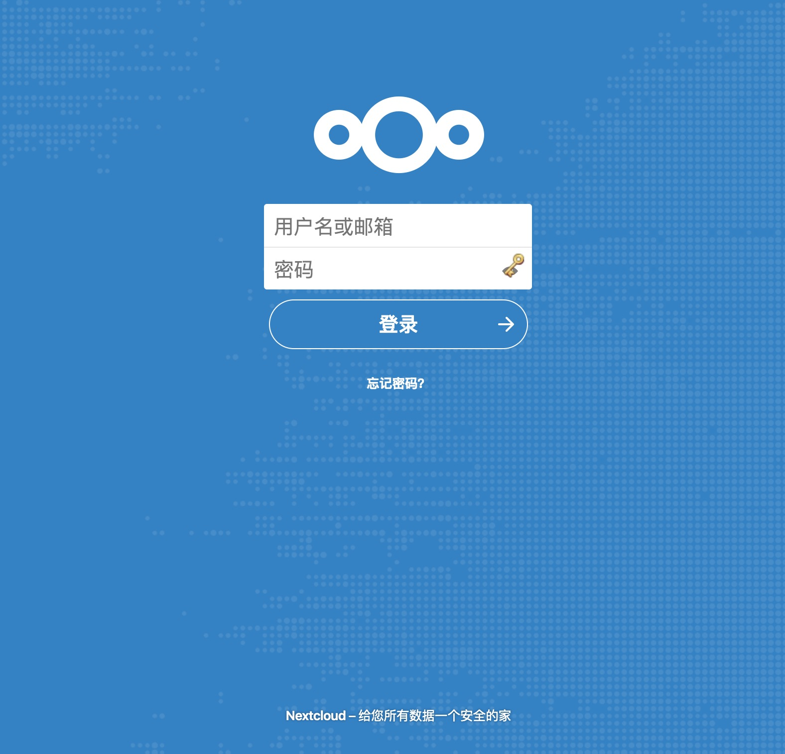

## 前言

之前一直都是用的 [owncloud](https://owncloud.org/) 来管理和同步一些自己的资料, 搭建在自己屋子里的服务器上.
然而最近需要上传和下载东西的时候发现由于受制于住的地方以及转发服务器的性能和带宽网速十分捉急.
之前随便转悠的时候发现了比 owncloud 更佳的替代和解决方案, 即 [nextcloud](https://nextcloud.com/).
刚巧之前想随便玩玩 OSS, 结合[这篇](https://qianrong.me/website/15.html)文章有了自己搭建一个 `Nextcloud` + `aliyun OSS` 做的想法.

> Nextcloud 是 Owncloud 的一个分支，原美国的 Owncloud 公司已倒闭由德国公司接手更新，其原创始人出走创立了 Nextcloud，由测试来看， 两者客户端是互通的，界面几乎一样，但 Nextcloud 使用更加灵活，比如可以自定义 Logo 和主题，功能更加强大，推荐用 Nextcloud

## OSS

OSS 即对象存储, 之前本来打算是拿来做图床, 然而发现根本没什么可放的(). 具体的购买和选购大概对比了下七牛云和阿里云的 OSS 发现如果存的东西比较多价格差别不是很大, 然而如果存的很少七牛有 40G 的免费存储量可以自己玩.
然而这里是因为刚好用阿里的 ECS 就刚好用他家 OSS 来做搭建了

### ossfs

由于要连接 oss 和 ECS 实例, 挂载阿里云的 oss 映射到服务器上, 需要下载阿里自己搞的一个包 ([GitHub Repo](https://github.com/aliyun/ossfs)), 根据[官方 README](https://github.com/aliyun/ossfs/blob/master/README-CN.md)安装就行, 以下对 Ubuntu 18.04 做一个示例

1.  下载安装

```bash
# 这里版本选择较新的符合自己系统的版本
cd ~

wget https://github.com/aliyun/ossfs/releases/download/v1.80.5/ossfs_1.80.5_ubuntu16.04_amd64.deb

sudo apt-get update

sudo apt-get install gdebi-core

sudo gdebi ./ossfs_1.80.5_ubuntu16.04_amd64.deb
```

2.  设置 ossfs 信息

```bash
cd /etc

sudo vim passwd-ossfs # 这里写入一行自己的oss信息, 格式为 <bucket名字>:<access-key-id(在阿里云控制台Accesskey找和创建)>:<access-key-secret>

# 注意这里权限如果不用默认路径需要改成 600
sudo chmod 640 /etc/passwd-ossfs

# 创建自己的挂载文件目录
cd /tmp && mkdir ossfs
```

3.  编写挂载脚本

```bash
cd ~/

# 这里加权限为了后面步骤
sudo vim start_ossfs.sh
```

然后写入

```bash
# 卸载
fusermount -u /tmp/ossfs

# 重新挂载 (这里需要前台运行 -f, 指定id是为了docker, 掩码是和 allow_other是为了控制挂载盘的docker进程访问权限)
exec ossfs my-bucket \
  my-mount-point \
  -ourl=my-oss-endpoint \
  -f -ouid=33 -ogid=0 -o allow_other -o mp_umask=007
```

4.  配置 supervisor

```bash
# 安装
sudo apt-get install supervisor
```

编辑 `/etc/supervisor/supervisord.conf` (也可以单独写一个加到 `conf.d`)

    [program:ossfs]
    command=bash /YOUR/PATH/TO/SCRIPT/start_ossfs.sh
    logfile=/var/log/ossfs.log
    log_stdout=true
    log_stderr=true
    logfile_maxbytes=1MB
    logfile_backups=10

5.  运行

```bash
sudo supervisord -c /etc/supervisor/supervisord.conf
```

6.  确认一切 OK

```bash
ps aux | grep supervisor # 应该能看到supervisor进程
ps aux | grep ossfs # 应该能看到ossfs进程
kill -9 ossfs # 杀掉ossfs进程，supervisor应该会重启它, 不要使用killall, 因为killall发送SIGTERM，进程正常退出，supervisor不再去重新运行ossfs
ps aux | grep ossfs # 应该能看到ossfs进程
sudo df -h # 应该能看到 ossfs 正确挂载
```

注意如果 `ossfs` 没有启动需要杀掉 `supervisor` 进程重新启动

### nextcloud

由于这里是采用 `Docker` 进行容器化部署, 就直接贴配置和文件了, `Docker` 的安装和使用不在此赘述. 另外 `Nginx` 反代和 `SSL` 的配置单独放在一起, 有时间稍后补上

1.  建立 `Docker` 的目录

```bash
cd ~ && mkdir compose

cd compose && mkdir nextcloud && cd nextcloud
```

2.  依次添加以下文件

-   `db.env`

```env
MYSQL_PASSWORD=YOUR_PASSWORD
MYSQL_DATABASE=nextcloud
MYSQL_USER=nextcloud
```

-   `docker-compose.yml`

```yml
version: '3'

services:
  db:
    image: mariadb
    command: --transaction-isolation=READ-COMMITTED --binlog-format=ROW
    restart: always
    volumes:
      - db:/var/lib/mysql
    environment:
      - MYSQL_ROOT_PASSWORD=YOUR_MYSQL_PASSWORD
    env_file:
      - db.env

  redis:
    image: redis
    restart: always

  app:
    build: ./app
    restart: always
    ports:
      - 8080:80
    volumes:
      - nextcloud:/var/www/html
      - ./custom_apps:/var/www/html/custom_apps
      - /tmp/ossfs:/var/www/html/data
    environment:
      - MYSQL_HOST=db
    env_file:
      - db.env
    depends_on:
      - db
      - redis

  cron:
    build: ./app
    restart: always
    volumes:
      - nextcloud:/var/www/html
      - ./custom_apps:/var/www/html/custom_apps
      - /tmp/ossfs:/var/www/html/data
    entrypoint: /cron.sh
    depends_on:
      - db
      - redis

volumes:
  db:
  nextcloud:
```

-   `Makefile`

```Makefile
down:
	docker-compose down

up:
	docker-compose up -d

start: down up
```

-   `./app/Dockerfile`

```Dockerfile
FROM nextcloud:apache

COPY redis.config.php /usr/src/nextcloud/config/redis.config.php
```

-   `./app/redis.config.php`

```php
<?php
$CONFIG = array (
  'memcache.locking' => '\OC\Memcache\Redis',
  'redis' => array(
    'host' => 'redis',
    'port' => 6379,
  ),
);
```

-   `custom_app`

```bash
mkdir custom_app

# 在改变权限之后如果要安装App的话就得用root权限了
sudo chown -R www-data:root ./custom_app
```

> 注意这里可以自己从[nextcloud 应用商店](https://apps.nextcloud.com/)来下载自定义 App 来安装解压放到这个目录下, 比如 talk 就不再是默认提供的 App 了 (由于文档比较老让直接到相关页面找害得找了半天)

3.  运行

```bash
make start
```

成功的话应该可以访问到服务期地址 `8080` 端口看到正确的登录画面



## 小结

-   上传下载速度有明显提升, 理论讲速度和带宽应该差不多一致
-   UI 和功能完整度以及安全性方面比 `owncloud` 有一些提升, 值得一搞
-   发现新的 UI 是拿 `Vue` 写的
-   首次登入输入完管理员账号之后出现连不上数据库的报错虽然比较莫名其妙但是多登入一次就行
-   要注意加载卷的权限, 这里挂载脚本设置权限是一个坑

## 参考

-   [how-to-install-nextcloud-talk-using-docker-on-alibaba-cloud](https://medium.com/@Alibaba_Cloud/how-to-install-nextcloud-talk-using-docker-on-alibaba-cloud-ffc8fb326405)
-   [installing-nextcloud-docker](https://blog.ssdnodes.com/blog/installing-nextcloud-docker/)
-   [understand-docker-uid](https://www.cnblogs.com/woshimrf/p/understand-docker-uid.html?spm=a2c4e.10696291.0.0.ad0a19a4PZkqWV)
-   [谈谈 Docker Volume 之权限管理](https://yq.aliyun.com/articles/53990)
